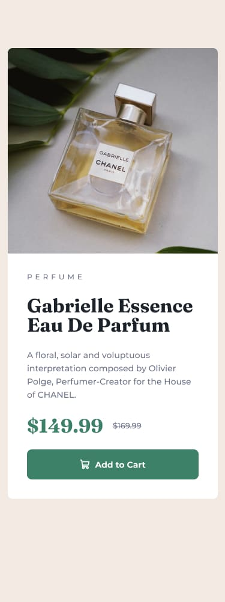

# Product Preview Card Component

A responsive product preview card built with plain HTML & CSS, showcasing hover states and layout transitions across mobile and desktop screens.

## 🚀 Live Demo

Check out the live version here:  
[https://product-preview-card-component-hb.vercel.app/](https://product-preview-card-component-hb.vercel.app/)

## 🔗 Repository

View the source code:  
[https://github.com/harshikab2112/Product-preview-card-component](https://github.com/harshikab2112/Product-preview-card-component)

---

## 🧠 What I Learned

- Solidified my understanding of **Flexbox** for layout alignment and centering elements effectively across different screen sizes.  
- Improved **responsive design techniques**, including mobile-first layout and switching styles with CSS media queries.  
- Practiced using **box-shadow** to enhance card depth, hover states on buttons, and focus styles for better user interaction and accessibility.

## ⚠️ Biggest Challenge

Matching the design’s spacing and alignment pixel‑perfectly between mobile and desktop layouts was tricky—especially getting the “Add to Cart” button hover styles and card margins to feel consistent with the design reference.

## 🛠 Built With

- HTML5 (semantic markup)  
- CSS3 (custom properties, Flexbox, media queries)  
- **Box-shadow** for subtle visual depth  
- Pure CSS for interactivity—no JavaScript

## ✨ Extra Features & Enhancements

- Added smooth **hover transition** on the "Add to Cart" button for better responsiveness feedback.  
- Focus-visible styles for accessibility, improving keyboard navigation support.  
- Custom hover state on the price display to highlight interactivity.

---

## 📁 Screenshot

---

## 🧭 Table of Contents

- [Overview](#product-preview-card-component)  
- [Live Demo](#-live-demo)  
- [Repository](#-repository)  
- [What I Learned](#-what-i-learned)  
- [Challenges](#-biggest-challenge)  
- [Built With](#-built-with)  
- [Enhancements](#-extra-features--enhancements)  
- [Screenshot](#-screenshot)

---

## ✅ Final Thoughts

This project improved my confidence in building fully responsive components with HTML and CSS. I enjoyed fine-tuning hover effects and layout details to match the Frontend Mentor design spec.

---

**Thanks for checking it out! 👋**
